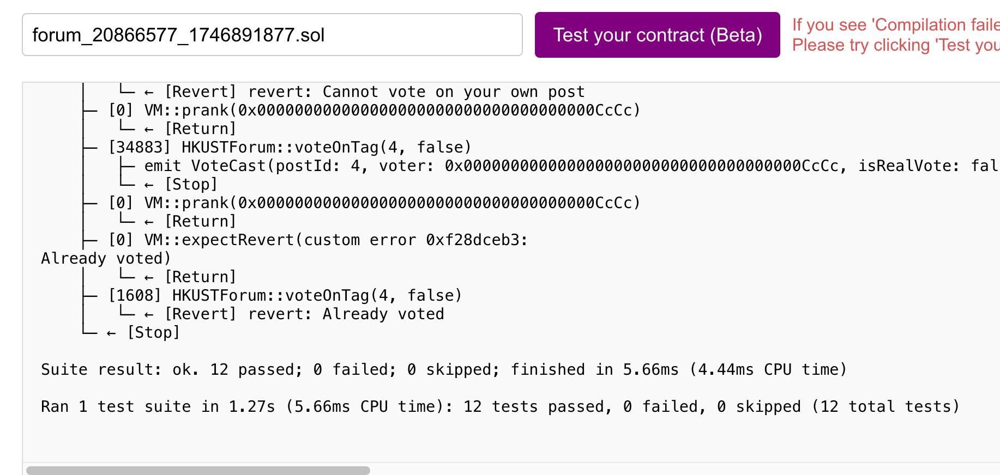
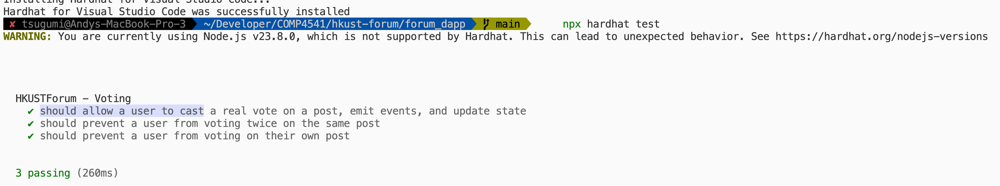

# HKUST Anonymous Forum - COMP4541

A decentralized anonymous forum for the HKUST community using Ethereum blockchain technology.

## Live Demo & Deployment

* **Live Demo:** [HKUST Anonymous Forum](https://hkust-anonymous-forum.vercel.app)
* **Blockchain:** Deployed on Sepolia Testnet
* **Smart Contract Address:** 0x4511277f98BA4282705Da1c250110E24Aa2f88a2

To interact with the forum, you'll need:
* A web3 wallet (like MetaMask)
* Some Sepolia ETH (available from [Sepolia faucets](https://sepoliafaucet.com/))


## Project Overview

We aim to provide a platform where all members of HKUST (students, professors, staff) can share thoughts, ask questions, and discuss topics relevant to our campus life, all while maintaining their anonymity. This forum is built on the idea that open dialogue, coupled with community-driven verification, can foster a more informed and connected HKUST.

## Features

The HKUST Anonymous Forum is a decentralized platform that allows you to:

*   **Post Anonymously:** Share your views without revealing your direct identity. We use a privacy-preserving system where your Ethereum address is used to generate a consistent anonymous identifier (e.g., "Anonymous Student #AB") along with the role you choose for your post or comment.
*   **Claim a Role (Tag):** When you post or comment, you can select a tag like "Student," "Professor," or "Staff" to give context to your contribution.
*   **Community Verification:** The authenticity of these role claims (tags) can be assessed by the community. Other users can vote on whether they believe a claimed tag is genuine or not.
*   **Transparent Discussions:** See what others are talking about, engage in discussions through comments, and see how the community perceives the authenticity of different roles claimed in posts.

## Tech Stack

- **Frontend:** React + Vite
- **Smart Contract:** Solidity
- **Ethereum Interaction:** ethers.js
- **UI Framework:** Custom CSS

## User Documentation

Learn how to use the HKUST Anonymous Forum with our detailed guides:

*   **01. Getting Started:** [Learn the basics: connecting your wallet and understanding anonymous IDs.](./docs/01-getting-started.md)
*   **02. Creating a Post:** [How to share your thoughts by creating a new post.](./docs/02-creating-a-post.md)
*   **03. Voting on Tags:** [Participate in community verification by voting on post tags.](./docs/04-voting-on-tags.md)
<!-- *   **04. Understanding Tag Statuses:** [What the different tag colors and statuses mean.](./docs/05-understanding-tag-statuses.md) -->
*   **04. Community Etiquette:** [Guidelines for a respectful and constructive forum.](./docs/07-community-etiquette.md)

## Key Features

*   **Easy Wallet Connection:** Securely connect using your existing Ethereum wallet (like MetaMask).
*   **Anonymous Posting & Commenting:** Share your thoughts freely. Your on-campus role is represented by a tag you choose, and your identity is a unique anonymous ID.
*   **Role Tagging:** Clearly indicate your perspective by choosing a tag (Student, Professor, Staff) for your posts and comments.
*   **Community Voting on Tags:** Participate in verifying the authenticity of claimed roles by voting "Real" or "Fake" on any post's tag.
*   **Dynamic Tag Status:** See at a glance how the community views a tag:
    *   **Green:** More "Real" votes.
    *   **Red (Disputed):** More "Fake" votes.
    *   **Orange (Contested):** Equal "Real" and "Fake" votes.
*   **View Posts and Comments:** Browse through discussions and see what your peers are saying.


## Testing and Security Considerations

### Testing Approach
The `HKUSTForum.sol` smart contract underwent a detailed code review focusing on its functional correctness and security robustness. While direct execution of a test suite was not part of this interactive session, a thorough testing strategy for such a contract would typically involve:
*   **Unit Testing:** Unit tests are implemented in `forum_dapp/tests/forum.test.js`. These tests cover key functionalities of the `HKUSTForum.sol` contract, with a particular focus on the `voteOnTag` mechanism. They verify that functions behave as expected with valid inputs, correctly handle invalid scenarios by reverting (as per `require` statements), and ensure accurate state changes and event emissions.
*   **Scenario-Based Integration Testing:** Simulating sequences of user actions, such as multiple users creating posts, adding comments, and voting on tags to observe the evolution of post states (e.g., `isTagChallenged`, vote counts, tag appearance logic on the frontend).
*   We also did testing from https://mycontract.fun/ and passed all the tests.
    

### Documenting Test Execution

This section outlines how to run the automated tests and provides a template for documenting manual testing interactions and observations.

**1. Running Automated Unit Tests (Hardhat)**

The project includes unit tests for the smart contract, located in the `forum_dapp/tests/` directory (e.g., `forum.test.js`). These tests verify the core functionalities and security constraints of the `HKUSTForum.sol` contract.

*   **Command to run tests:**
    ```bash
    cd forum_dapp
    npx hardhat test
    ```
    

---

### Security Review Highlights
We took a close look at the smart contract's security, focusing on common vulnerabilities and how our design addresses them:
*   **Leveraging Modern Solidity:** By using Solidity version `^0.8.19`, the contract automatically benefits from built-in safeguards against common arithmetic issues like integer overflows and underflows.
*   **Core Security Measures in Place:**
    *   **Input Sanitization:** Inputs are carefully checked. For instance, post and comment IDs are validated to ensure they're within expected ranges, which helps prevent errors and potential misuse.
    *   **Fair Voting Rules:** To keep voting fair, the system prevents users from voting on their own posts and limits each user to one vote per post. This design discourages attempts to unfairly influence tag statuses.
    *   **Gas Usage Management:** We've been mindful of transaction costs (gas). Functions that fetch multiple data items, such as `getCommentsBatch`, include a `MAX_BATCH_SIZE` limit. This prevents individual requests from becoming too expensive or failing due to excessive gas requirements.
    *   **Reentrancy Protection:** The contract is structured to guard against reentrancy attacks. This is achieved by following best practices, such as avoiding calls to external unknown contracts before state changes are finalized. The contract's core logic also doesn't involve direct Ether transfers, which further simplifies reentrancy considerations.
*   **Other Design Points to Note:**
    *   *Initial Content:* When the forum is first set up, it includes some predefined posts and voting data. This is a deliberate choice to help with demonstration and provide an initial state for the forum.
    *   *Post and Tag Lengths:* There are no strict limits on the length of post content or tags within the contract itself. Users are responsible for the gas costs associated with the length of their input, meaning extremely long strings are technically possible but would be costly.
    *   *Use of Timestamps:* The forum uses `block.timestamp` to record when posts and comments are made, which is a standard approach. While miners have a small degree of influence over these timestamps, this isn't considered a critical risk for the forum's intended operation.


## Note

This is just a demo project for COMP4541. **No circulation** of this project is allowed.
