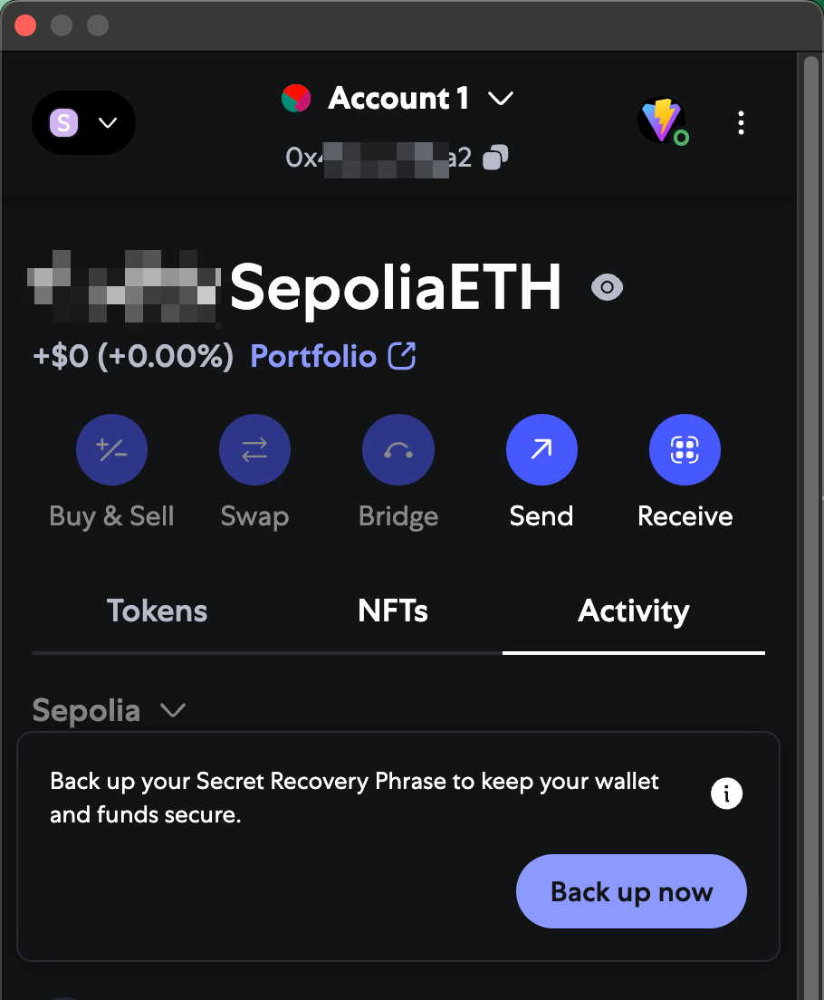
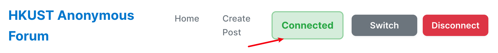
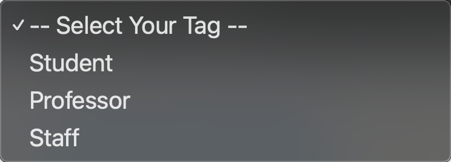

# Getting Started with the HKUST Anonymous Forum

Welcome! This guide covers your first steps on the HKUST Anonymous Forum.

## 1. What You'll Need

An Ethereum wallet is required to interact (post, vote, comment). We recommend [MetaMask](https://metamask.io/).

*   **Install MetaMask:** Get the browser extension if you don't have it.
*   **Set up Wallet:** Create or import a wallet. Ensure some SepoliaETH for gas fees if on the Sepolia testnet.

    
    
Connect Wallet Button Example

## 2. Connecting Your Wallet

Look for a "Connect Wallet" button on the forum.

*   Click it. MetaMask will ask for connection approval. Approve it.
*   The button should then show your connected status.

    
    
Wallet Connected Status Example

This is usually once per session unless you disconnect.

## 3. Understanding Your Anonymous Identity

Your Ethereum address isn't directly displayed. Instead, the forum generates a unique ID for you (e.g., "Anonymous Student #AB") based on your chosen tag and the first two characters of your address (after "0x"). This preserves privacy while allowing some consistency.

## 4. A Quick Look at Tags

When posting or commenting, you select a **tag** (e.g., "Student", "Professor", "Staff") representing your role for that contribution. These tags can be voted on by the community for authenticity – a core feature!

    
    
Tag Selection Example

## Next Steps

Ready to explore more?
*   [Creating Your First Post](./02-creating-a-post.md)
*   [Voting on Tags](./03-voting-on-tags.md) 