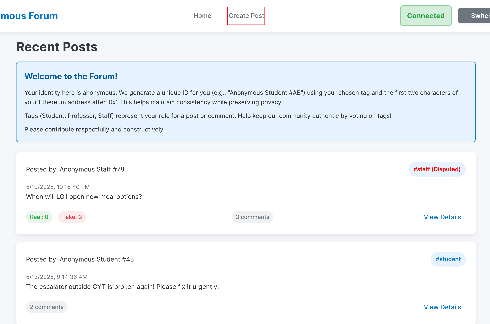
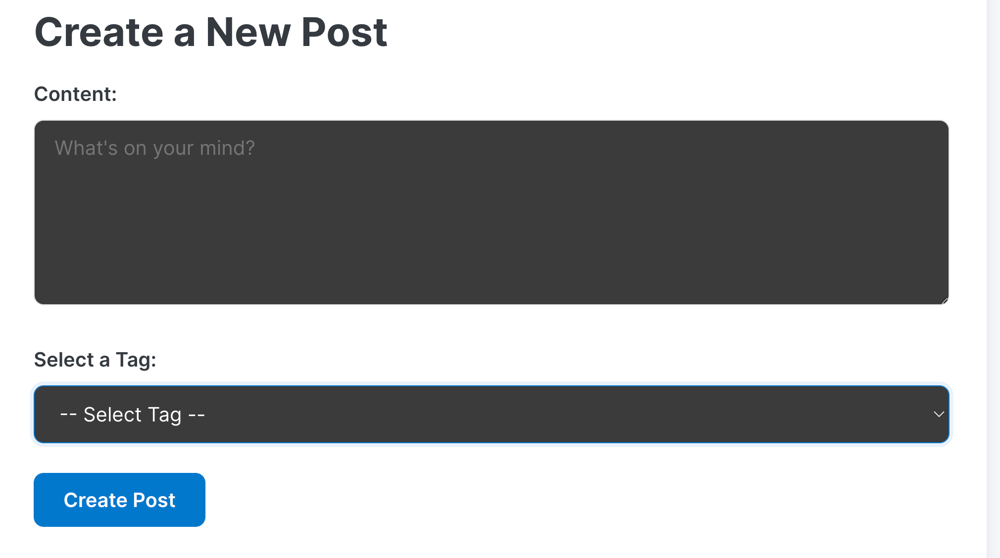

# Creating Your First Post

This guide explains creating new posts on the HKUST Anonymous Forum.

## Prerequisites

*   Wallet connected (see [Getting Started](./01-getting-started.md)).

## Steps to Create a Post

1.  **Navigate to Create Post Page:** Find and click the "Create Post" button/link.

    
    
Create Post

    This takes you to the post creation form.

2.  **Fill in Post Details:**

    
    
Create Post

    *   **Choose Tag:** Select a tag ("Student", "Professor", "Staff") for your post. This sets the context and can be voted on by the community.
    *   **Write Content:** Enter your post text (question, announcement, etc.).

3.  **Submit Post:**
    *   Click "Submit Post".
    *   MetaMask (or your wallet) will request transaction confirmation (for gas fee).
    *   Confirm in your wallet.

4.  **Post Confirmation:** After blockchain confirmation (few seconds), your post is live. You might be redirected.

## Example: Simple Test Post

1.  Go to "Create Post" page.
2.  **Tag:** Select `Student`.
3.  **Content:** Type `This is a test post.`
4.  Submit and confirm in MetaMask.

Your post appears, similar to **Post #1** (student tag, content "test"). Others see it from "Anonymous Student #XY" and can view, comment, or vote on its tag.

## What Happens Next?

Your post is visible; users can view, comment, and vote on its tag.

Ready to learn more?

*   [Voting on Tags](./03-voting-on-tags.md) 