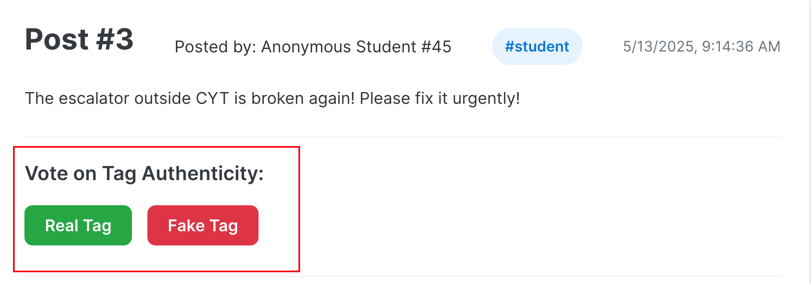
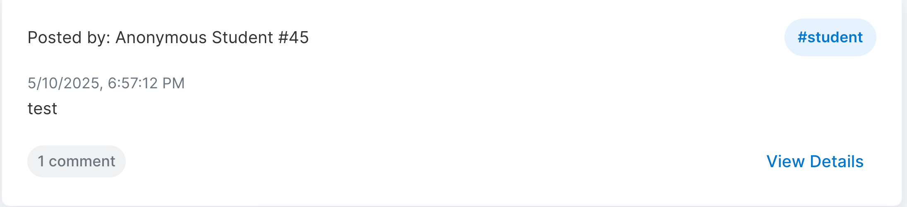
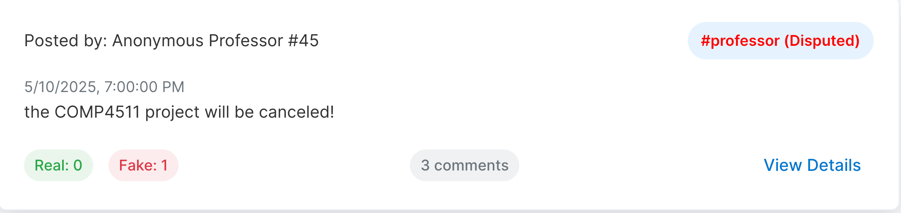

# Voting on Tags: Ensuring Authenticity

Voting is a key feature of the HKUST Anonymous Forum. It allows the community to collectively assess the authenticity of the role (tag) claimed by a poster.

## Why Vote?

Your vote helps maintain transparency and trust by indicating how the community perceives a poster's claimed role (e.g., "Professor," "Student," "Staff"). This encourages responsible tagging and highlights potentially misleading claims.

## How to Vote

1.  **Navigate to a Post:** Open the detail page of any post.
2.  **Find Voting Buttons:** If you're eligible (not the post author, haven't voted yet), you'll see "Real Tag" and "Fake Tag" buttons.

3.  **Cast Your Vote:**
    *   Click "Real Tag" if you believe the tag is genuine for the post's context.
    *   Click "Fake Tag" if you believe it's misleading.
4.  **Confirm Transaction:** Approve the small transaction in your wallet (e.g., MetaMask).
5.  **See Update:** Vote counts refresh, and the tag's appearance (color/suffix) might change. Voting buttons for you on this post will disappear.

**Important Note on First Vote:** The very first vote cast on a post's tag (whether "Real" or "Fake") also marks that tag as `isTagChallenged` in the system. This flag (`isTagChallenged`) signifies that the tag's authenticity is now under community review. It is the initial trigger that allows vote counts to be displayed and the tag's appearance to potentially change (e.g., to green, red, or orange) based on the evolving ratio of 'Real' to 'Fake' votes. The `isTagChallenged` flag itself becoming true does not inherently mean the tag is considered 'Fake' or 'Disputed'; those statuses arise from the subsequent vote tallies.

## Voting Scenarios & Examples

# Understanding Tag Statuses

Tags on the HKUST Anonymous Forum have different visual statuses (colors and text suffixes) based on community votes. This guide helps you understand what they mean.

When a user creates a post, they select a tag (e.g., "Student", "Professor", "Staff") to represent their claimed role. The community then votes on its authenticity.

## How Tag Status is Determined

The appearance of a tag changes based on the balance of "Real" versus "Fake" votes:

1.  **Default / No Votes:**
    *   **Appearance:** Standard color, no suffix.
    
    *   **Meaning:** No votes yet; authenticity unconfirmed.

2.  **Green / Verified (Implicitly):**
    *   **Appearance:** Tag text is **green**.
    *   **Meaning:** `Real Votes > Fake Votes`. Community generally agrees with the tag.

3.  **Red / Disputed:**
    *   **Appearance:** Tag text is **red**, suffix like "(Disputed)".
    
    *   **Meaning:** `Fake Votes > Real Votes`. Significant community doubt.

4.  **Orange / Contested:**
    *   **Appearance:** Tag text is **orange**, suffix like "(Contested)".
    *   **Meaning:** `Real Votes == Fake Votes` (and `Real Votes > 0`). Divided community opinion.

## Why Statuses Matter

These visual cues help assess credibility:
*   **Green:** May lend more credence.
*   **Red (Disputed):** View with caution; examine comments/votes.
*   **Orange (Contested):** Jury is out; read comments carefully.

Statuses are dynamic and change with new votes.
